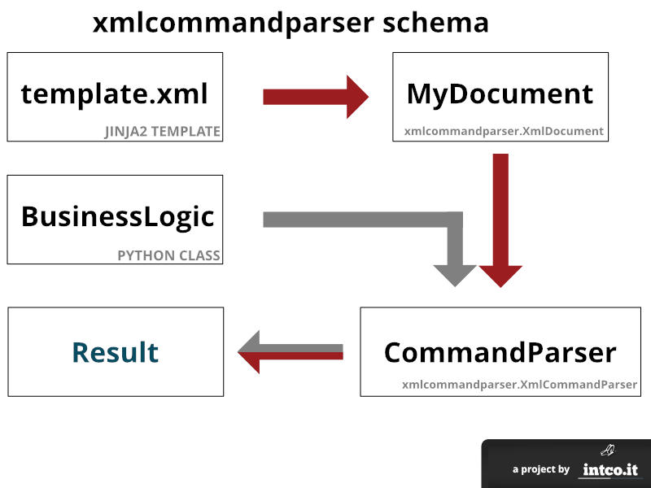

# xmlcommandparser

A class that binds xml tags to python class methods

## Requirements

- Python 2.7 with the following packages
    - lxml
    - jinja2

## Why?

I needed a simple way to let users store, share and edit reports and documents

## What it does?

Take an xml file and process it by calling each method associated with the correspondig xml tag. [See the `simple` example](samples/simple/README.md) 

## Getting Started

- Browse the `samples` folder and launch the `simple.py` example inside the `simple` folder. [More information](samples/simple/README.md)
- Read about the [XML formatters](docs/XML.md)
- Browse the `samples` folder and launch the `formatters.py` example inside the `formatters` folder. [More information](samples/formatters/README.md)
- Read about the [Hooks](docs/HOOKS.md)
- Browse the `samples` folder and launch the `beforeaftercommands.py` example inside the `beforeaftercommands` folder. [More information](samples/beforeaftercommands/README.md)

## Getting Help

Feel free to open an issue using the `question` tag

## License

This project is released under the [MIT License](LICENSE)